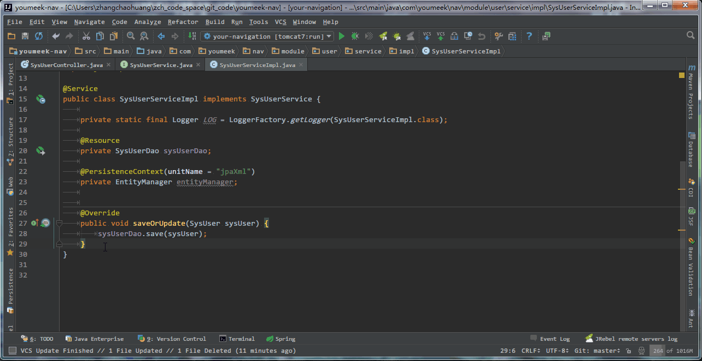
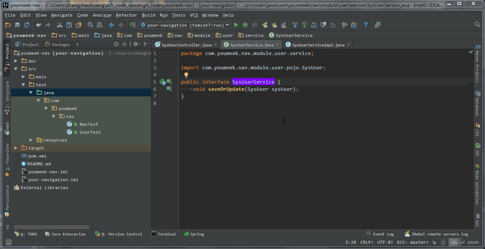
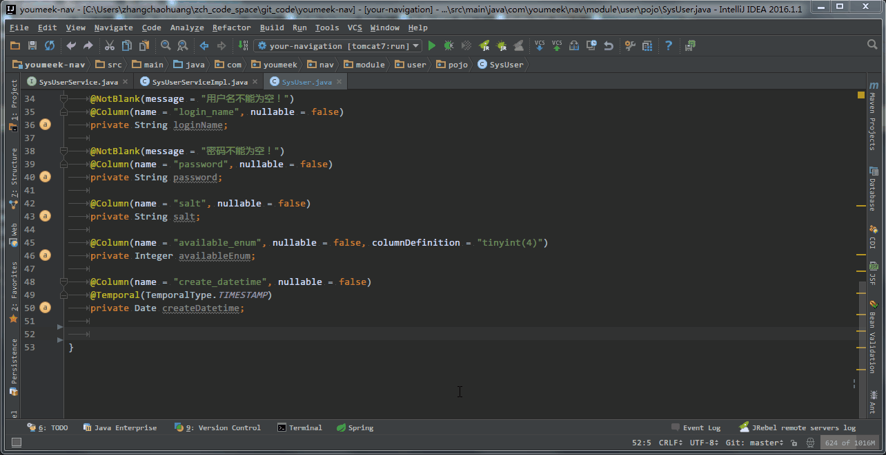

# 最特殊的快捷键 Alt + Enter 介绍

## 说明

这是一个非常特殊的快捷键，有必要拿出来单独讲

可以从几个思路：Java 类、JSP、HTML、JavaScript、CSS、SQL 等文件类型

## 智能辅助

> * 在 **接口类** 中，如果光标当前所在的方法，已经在 **接口实现类** 中生成了，则此快捷键的效果是跳转。
> * 在 **接口类** 中添加一个方法后，让该 **接口实现类** 也跟着生成

> * 在 **接口实现类** 中添加一个方法后，让该 **接口类** 也跟着生成

> * 对当前光标所在类，生成单元测试类

> * 对当前光标所在类，创建子类，常用在对接口生成接口实现类

> * 移除未使用的变量、对象等元素

> * 对属性创建 set、get 方法

- 待整理：
	- 添加 doc
	- 把自己造的单词加入词库中
	- 快速移除当前类所继承的接口，并且同时清空已经写好的该接口所有的 Override 方法
	- 修改光标当前元素的作用域
	- 从接口实现类中的方法跳转到接口类中
	- 根据 Language Level 给不同意见，比如：List<SysRole> sysRoleList = new ArrayList<SysRole>(); 和 List<SysRole> sysRoleList = new ArrayList<>();
	- 切换成静态导入，比如：CollectionUtils.isNotEmpty
	- 自动添加强转前缀内容
	- 给 hibernate 的 Entity 对象分配数据源，从而产生一系列智能功能
	- 对光标所在的对象进行包导入

